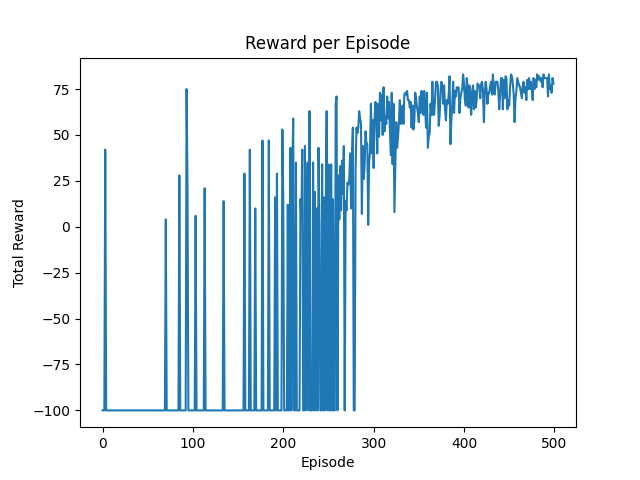

# 🤖 RL-based Buggy

A Reinforcement Learning project where a virtual buggy (agent) learns to navigate a dynamic grid world filled with static and moving obstacles. Using the **Q-Learning** algorithm, the agent gradually improves its path-finding strategy through trial and error, ultimately learning to reach the goal efficiently while avoiding collisions.

---

## 🚀 Demo

After training, the agent learns the optimal path and reaches the destination consistently.



🎥 **Demo Videos**

- ▶️ Before Learning (Exploration Phase)  
  [📥 Download before_learning.mp4](media/before_learning.mp4)

- ▶️ After Learning (Optimal Path)  
  [📥 Download after_learning.mp4](media/after_learning.mp4)

- ▶️ Improved Simulation (Optimal Path)  
  [📥 Download Improved_Simulation.mp4](media/Improved_Simulation.mp4)

---

## 🧠 What’s Inside

This project uses a custom environment built with Python and visualized using **pygame**.  
The agent learns using **Q-learning** and stores its knowledge in a Q-table.

---

## 📁 Project Structure

RL-based-Buggy/
├── env.py # GridWorld environment (walls, goal, agent)
├── q_learning_agent.py # Agent with Q-table and learning logic
├── train.py # Training loop for the agent
├── visualize.py # Pygame simulation after training
├── q_table.pkl # Saved Q-table after training
├── reward_plot.png # Reward vs Episodes graph
├── main.py # (Optional) Launcher or entry script
├── media/ # Demo videos folder
│ ├── before_learning.mp4
│ ├── after_learning.mp4
│ └── Improved_Simulation.mp4
├── assets/ # Visual & sound assets
│ ├── car.png
│ ├── tree.png
│ ├── goal.png
│ ├── goal.wav
│ └── bump.wav
├── .gitignore # Ignoring cache and binary files
└── README.md # You’re reading this now!

yaml
Copy code

---

## 📦 Requirements

Install the required libraries:

```bash
pip install pygame matplotlib numpy
Or use the requirements.txt file:

nginx
Copy code
pygame
matplotlib
numpy
🏁 How to Run
1. Clone the Repository
bash
Copy code
git clone https://github.com/freak29/RL-based-Buggy.git
cd RL-based-Buggy
2. Train the Agent
bash
Copy code
python train.py
3. Visualize the Learned Policy
bash
Copy code
python visualize.py
📚 Concepts Used
Q-Learning

Grid-based Pathfinding

Exploration vs Exploitation (Epsilon-Greedy)

Reward Shaping

Pygame Visualization

🛠️ Future Improvements
Add more intelligent dynamic obstacles

Implement Deep Q-Learning (DQN)

Port to a real-world robot using Raspberry Pi or Arduino

🧑‍💻 Author
Vaibhav Shikhar Singh
📧 reachvaibhav29@gmail.com
🔗 GitHub: freak29

📄 License
This project is licensed under the MIT License.

yaml
Copy code

---
